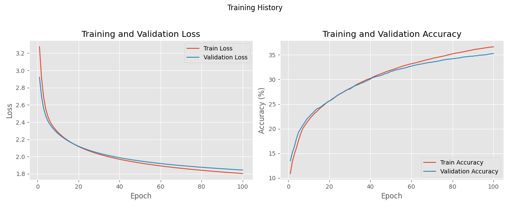
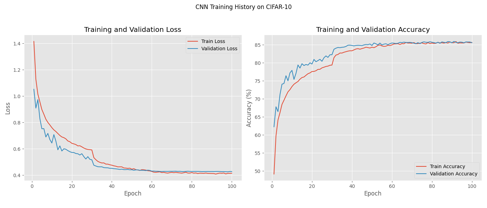

# CIFAR-10 Neural Network Implementations

This repository contains two Python scripts demonstrating neural network models for image classification on the CIFAR-10 dataset.

The primary goal is to showcase two different approaches to building and training image classifiers:
1.  A **manual implementation** of a simple Fully Connected Neural Network (FCNN) to understand the fundamental mechanics.
2.  A **Convolutional Neural Network (CNN)** built using PyTorch's high-level `nn.Module`, incorporating common deep learning practices.

Both models are trained and evaluated on the CIFAR-10 dataset.

## Model 1: Manual FCNN Training History



### Loss Analysis:

Both training and validation loss decrease steadily from initial high values (around 3.2) and begin to plateau after approximately 40-50 epochs.
The final loss values settle around 1.8 for training and slightly higher (around 1.85) for validation.
The validation loss closely tracks the training loss, indicating that significant overfitting is not the primary issue; instead, the model's simplicity likely limits its learning capacity.

### Accuracy Analysis:

Training and validation accuracy increase from around 10%, with the rate of improvement slowing after 40-50 epochs.
The model achieves a final training accuracy of about 37-38% and a validation accuracy of around 35-36%.
The small gap between training and validation accuracy further suggests the model is underfitting or has reached its capacity rather than overfitting.

### Overall Performance: 

The manual FCNN demonstrates that learning is occurring. However, its performance is modest, achieving around 35% validation accuracy. This is expected due to its very simple architecture (a single hidden layer, no convolutional layers to effectively process image features) and basic optimization.

## Model 2: PyTorch CNN Training History



### Loss Analysis:

Training and validation loss decrease much more rapidly and reach significantly lower values compared to the manual FCNN.
Training loss starts around 1.4-1.5 and drops sharply, plateauing near 0.4.
Validation loss also shows a steep decline, consistently staying slightly above the training loss, and stabilizes around 0.40-0.45.
A small, stable gap between training and validation loss is maintained, which is typical. The validation loss does not show signs of detrimental increase in later epochs, indicating controlled overfitting.

### Accuracy Analysis:

Both training and validation accuracy show a dramatic improvement, starting from around 50%.
Training accuracy climbs to over 85% (potentially 87-88%).
Validation accuracy reaches a strong plateau around 85-86%.
A consistent gap exists between the higher training accuracy and validation accuracy. This is common in more complex models. The validation accuracy's stable plateau indicates good generalization.

### Overall Performance: 

The CNN significantly outperforms the manual FCNN. It achieves a validation accuracy of around 85-86%. This substantial improvement is attributable to:

- Convolutional Layers: Effective for extracting spatial hierarchies of features from images.
- Batch Normalization: Stabilizes and accelerates training.
Dropout: Provides regularization, reducing overfitting.
- Adam Optimizer: A more sophisticated and often faster converging optimization algorithm.
- Data Augmentation: Increases the effective size and diversity of the training set.

## Models Included

### 1. Manual Two-Layer Neural Network (`FCNN.py`)

* **Description:** A basic two-layer FCNN where forward propagation, backward propagation (backpropagation), activation functions (ReLU), and the cross-entropy loss function are implemented manually using PyTorch tensors.
* **Architecture:**
    * Input layer (flattened image)
    * One hidden layer with ReLU activation
    * Output layer (logits)
* **Optimization:** Manual batch gradient descent (gradients accumulated over the entire epoch before updating weights).
* **Purpose:** Educational, to illustrate the core concepts of neural network training.

### 2. PyTorch CNN (`CNN.py`)

* **Description:** A Convolutional Neural Network leveraging PyTorch's `nn.Module` for a more streamlined and powerful implementation.
* **Architecture:**
    * Two Convolutional layers (with Batch Normalization, ReLU, Max Pooling)
    * One Fully Connected hidden layer (with Batch Normalization, ReLU, Dropout)
    * Output Fully Connected layer (logits)
* **Optimization:** Adam optimizer.
* **Features:** Includes data augmentation, learning rate scheduling, batch normalization, and dropout.
* **Purpose:** To build a more effective image classifier using standard PyTorch practices and common CNN techniques.

## Requirements

* Python 3.x
* PyTorch (`torch`)
* TorchVision (`torchvision`)
* Matplotlib (`matplotlib`)

You can install the necessary libraries using pip:
```bash
pip install torch torchvision matplotlib